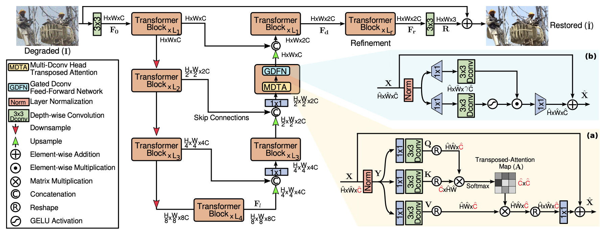

# Restormer

A PyTorch implementation of Restormer based on CVPR 2022 paper
[Restormer: Efficient Transformer for High-Resolution Image Restoration](https://arxiv.org/abs/2111.09881), which I did a presentation on for the Advances for Machine Vision Module. 

The training was done only for the Deraining task using Tesla A100 in Google Colab. Due to the high requirement of GPU memory, the `batch_size` and `patch_size` was reduced. 

